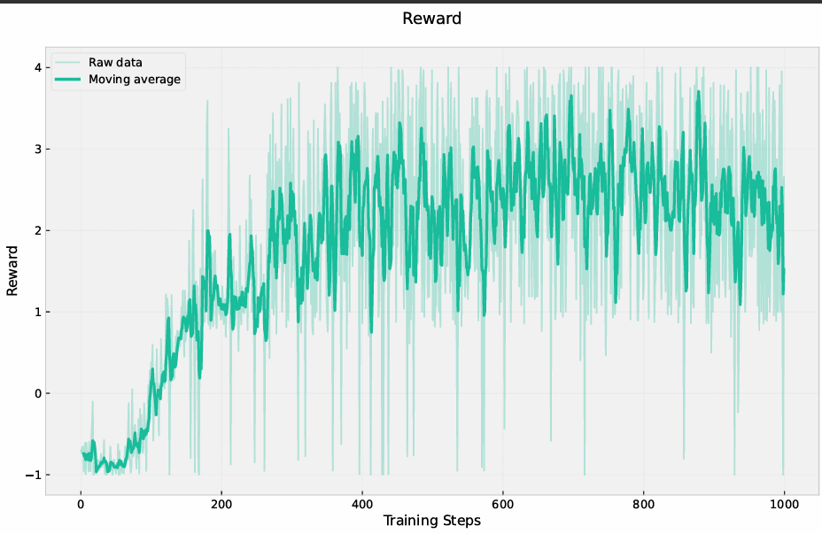
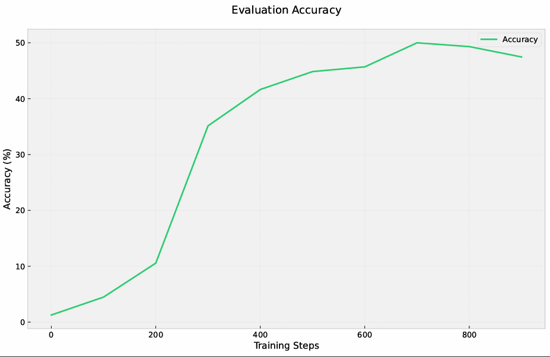

# Setup

All experiments were run on Vast.ai GPU instances.

- **1× H100 SXM**: GRPO training for Qwen2-0.5B and Qwen2-1.5B, and SFT experiments for Qwen2-0.5B
- **2× H100 SXM**: GRPO training for Qwen2-7B

GPT-4o (via OpenAI API) was used to generate 700 samples of SFT training data.

# Task 1: Environment Setup & Bug Fixes

## Part A: uv Setup

### Dependency Migration

Converted `requirements.txt` to `uv` + `pyproject.toml`:

```bash
uv init --no-readme
uv python install 3.10
uv venv --python 3.10
uv add -r requirements.txt
uv sync
```

The original `requirements.txt` was a full `pip freeze` dump of a system environment. It was cleaned down to only packages actually imported  or of relevance to the codebase.

### Flash Attention 2

```bash
uv pip install flash-attn --no-build-isolation
```

`--no-build-isolation` is required so the build process can see the existing PyTorch/CUDA installation. Without it, compilation fails. Takes ~15 minutes to compile from source.

---

## Part B: Bug Fixes in `evaluator.py`

### Bug 1 — No penalty for wrong answers

```python
# before
rewards.append(2.0 if pred_i == gt_i else 0.0)

# after
rewards.append(2.0 if pred_i == gt_i else -1.0)
```

Wrong answers got `0.0` , same as missing tags. GRPO learns by comparing rewards relatively hence a contrastive definiton (`2.0` vs `-1.0`) gives a stronger training signal.

### Bug 2 — Missing tags not penalised

```python
# add explicit check before comparison
if not pred:
    rewards.append(-1.0)
    continue
```

When no `<answer>` tags are found, `_extract_xml_answer` returns `""`. Without this check, missing tags too get `0.0` — same as a wrong answer with correct format.

### Bug 4 — Duplicate tags not penalised in `_xml_count_reward`

```python
# before
r_open = "<reasoning>" in text   # True even if tag appears multiple times

# after
r_open  = text.count("<reasoning>") == 1
r_close = text.count("</reasoning>") == 1
a_open  = text.count("<answer>") == 1
a_close = text.count("</answer>") == 1
```

# Task 2

## Part A: GRPO Loss Implementation

The standard GRPO paper formulates the policy objective using an importance sampling ratio:

```
policy_obj_t = [π_θ(a_t|s_t) / π_old(a_t|s_t)] * A_i
```

This ratio is necessary when **multiple gradient updates are performed on the same rollouts** (µ > 1),
because after the first update π_θ ≠ π_old and the ratio drifts from 1. In that setting,
`clamp_epsilon` clips the ratio to `[1-ε, 1+ε]` for stability, which is identical to PPO clipping.

**However, inspecting the training loop in `main.py` reveals this codebase is fully on-policy:**

```python
for round_num in range(start_step, args.num_train_iters):
    question, answer = next(train_loader)
    total_loss = grpo_loss(...)  # generates NEW completions from current policy
    total_loss.backward()
    optimizer.step()            # weights update immediately
```

Fresh completions are generated from the current policy at every iteration and a gradient
step is taken immediately. There is no inner loop reusing rollouts (effectively µ=1). Therefore:

```
π_θ(a_t|s_t) / π_old(a_t|s_t) = 1   always
```

This means:

- The importance sampling ratio is always 1 and adds no information
- `clamp_epsilon` never activates and is irrelevant
- The policy gradient simplifies to pure REINFORCE.

The implemented loss is:

```
L = -1/N * Σ_i [ 1/T_i * Σ_t [ A_i * log π_θ(a_t|s_t) - β * KL_t ] ]
```

where the KL penalty uses the approximation from DeepSeek-R1:

```
KL_t = exp(log π_ref - log π_θ) - (log π_ref - log π_θ) - 1
```

This is always >= 0 and equals 0 when π_θ = π_ref.

### What Would Change for Multi-Epoch GRPO

To extend this to true multi-epoch GRPO (µ > 1), three changes are needed:

1. Save `old_logps` before the inner loop:

```python
with torch.inference_mode():
    old_logps = get_per_token_logps(model, ...).detach()
```

1. Replace the policy objective with the clipped ratio:

```python
ratio = torch.exp(per_token_logps - old_logps)
clipped = torch.clamp(ratio, 1 - args.clamp_epsilon, 1 + args.clamp_epsilon)
per_token_policy_obj = torch.min(ratio * advantages, clipped * advantages)
```

1. Add an inner loop reusing the same rollouts for µ steps before generating new ones.


## Part B: Training & Results:

### Total Reward During Training



### Evaluation Accuracy

