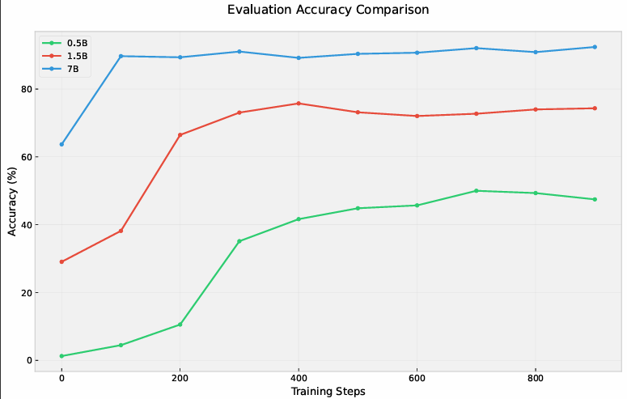
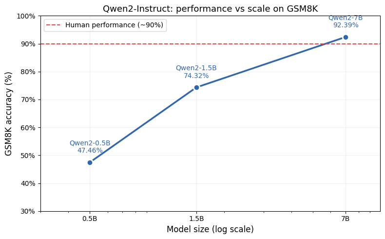

# Setup

All experiments were run on Vast.ai GPU instances.

- **1× H100 SXM**: GRPO training for Qwen2-0.5B and Qwen2-1.5B, and SFT experiments for Qwen2-0.5B
- **2× H100 SXM**: GRPO training for Qwen2-7B

GPT-4o (via OpenAI API) was used to generate 700 samples of SFT training data.

# Task 1: Environment Setup & Bug Fixes

## Part A: uv Setup

### Dependency Migration

Converted `requirements.txt` to `uv` + `pyproject.toml`:

```bash
uv init --no-readme
uv python install 3.10
uv venv --python 3.10
uv add -r requirements.txt
uv sync
```

The original `requirements.txt` was a full `pip freeze` dump of a system environment. It was cleaned down to only packages actually imported  or of relevance to the codebase.

### Flash Attention 2

```bash
uv pip install flash-attn --no-build-isolation
```

`--no-build-isolation` is required so the build process can see the existing PyTorch/CUDA installation. Without it, compilation fails. Takes ~15 minutes to compile from source.

---

## Part B: Bug Fixes in `evaluator.py`

### Bug 1 — No penalty for wrong answers

```python
# before
rewards.append(2.0 if pred_i == gt_i else 0.0)

# after
rewards.append(2.0 if pred_i == gt_i else -1.0)
```

Wrong answers got `0.0` , same as missing tags. GRPO learns by comparing rewards relatively hence a contrastive definiton (`2.0` vs `-1.0`) gives a stronger training signal.

### Bug 2 — Missing tags not penalised

```python
# add explicit check before comparison
if not pred:
    rewards.append(-1.0)
    continue
```

When no `<answer>` tags are found, `_extract_xml_answer` returns `""`. Without this check, missing tags too get `0.0` — same as a wrong answer with correct format.

### Bug 4 — Duplicate tags not penalised in `_xml_count_reward`

```python
# before
r_open = "<reasoning>" in text   # True even if tag appears multiple times

# after
r_open  = text.count("<reasoning>") == 1
r_close = text.count("</reasoning>") == 1
a_open  = text.count("<answer>") == 1
a_close = text.count("</answer>") == 1
```

# Task 2

## Part A: GRPO Loss Implementation

The standard GRPO paper formulates the policy objective using an importance sampling ratio:

$$\mathcal{L}^{GRPO} = \frac{\pi_{\theta}(a_t \mid s_t)}{\pi_{\theta}^{old}(a_t \mid s_t)} \cdot \hat{A}_i$$

This ratio is necessary when **multiple gradient updates are performed on the same rollouts**,
because after the first update π_θ ≠ π_old and the ratio drifts from 1. In that setting,
$\epsilon$ clips the ratio to $[1-\varepsilon, 1+\varepsilon]$ for stability, which is identical to PPO clipping.

**However, inspecting the training loop in `main.py` reveals this codebase is fully on-policy:**

```python
for round_num in range(start_step, args.num_train_iters):
    question, answer = next(train_loader)
    total_loss = grpo_loss(...)  # generates NEW completions from current policy
    total_loss.backward()
    optimizer.step()            # weights update immediately
```

Fresh completions are generated from the current policy at every iteration and a gradient
step is taken immediately. There is no inner loop reusing rollouts.

Since rollouts are generated fresh each iteration:

$$\frac{\pi_{\theta}(a_t \mid s_t)}{\pi_{\theta}^{old}(a_t \mid s_t)} = 1 \quad \forall t$$

This means:
- The importance sampling ratio is always 1 and adds no information
- the clipping objective never activates and is irrelevant — the ratio never leaves $[1-\varepsilon, 1+\varepsilon]$
- The policy gradient simplifies to pure REINFORCE style.

The implemented loss is therefore:

$$\mathcal{L}(\theta) = -\frac{1}{N}\sum_{i=1}^{N} \frac{1}{T_i}\sum_{t=1}^{T_i} 
\left[ \hat{A}_i \cdot \log\pi_{\theta}(a_t \mid s_t) - \beta \cdot \widehat{\mathbb{KL}}_t \right]$$

where the KL penalty uses the approximation from DeepSeek-R1:

$$\widehat{\mathbb{KL}}_t = e^{\delta_t} - \delta_t - 1, \quad \delta_t = \log\pi_{ref}(a_t \mid s_t) - \log\pi_{\theta}(a_t \mid s_t)$$

This estimator is always $\geq 0$ and equals $0$ only when $\pi_{\theta} = \pi_{ref}$.

To extend this to true multi-epoch GRPO , three changes are needed:

1. Save `old_logps` before the inner loop:

```python
with torch.inference_mode():
    old_logps = get_per_token_logps(model, ...).detach()
```

1. Replace the policy objective with the clipped ratio:

```python
ratio = torch.exp(per_token_logps - old_logps)
clipped = torch.clamp(ratio, 1 - args.clamp_epsilon, 1 + args.clamp_epsilon)
per_token_policy_obj = torch.min(ratio * advantages, clipped * advantages)
```

1. Add an inner loop reusing the same rollouts for µ steps before generating new ones.


## Part B: Training & Results:

### Total Reward During Training


### Evaluation Accuracy


# Task 3: Scaling Laws Analysis

### Setup Changes for Multi-GPU (Qwen2-7B)

Training Qwen2-7B required two changes from the default single-GPU setup:

**1. `llms.py` — switched to `device_map="auto"`:**

The original code used `device_map=None` with `.to(device)` which loads the entire
model onto a single GPU. For 7B with model + base_model (~28GB VRAM each), this OOMs
on a single H100 (80GB). Switching to `device_map="auto"` lets HuggingFace automatically
spread layers across both GPUs:
```python
# before
model = AutoModelForCausalLM.from_pretrained(
    model_name,
    torch_dtype=torch.bfloat16,
    attn_implementation="flash_attention_2",
    device_map=None,
).to(device)

# after
model = AutoModelForCausalLM.from_pretrained(
    model_name,
    torch_dtype=torch.bfloat16,
    attn_implementation="flash_attention_2",
    device_map="auto",  # spreads across all available GPUs
)
```

**2. `main.py` — device inference from model parameters:**

With `device_map="auto"` the model lives across multiple devices so there is no single
`device` to move tensors to. Fixed by inferring the device from the model's first parameter:
```python
# before
prompt_ids = prompt_ids.to(device)
prompt_mask = prompt_mask.to(device)

# after
model_device = next(model.parameters()).device
prompt_ids = prompt_ids.to(model_device)
prompt_mask = prompt_mask.to(model_device)
```

Both changes are backwards compatible — on a single GPU `device_map="auto"` simply
places everything on `cuda:0`, identical to the original behaviour.

---

### Results

#### Plot 1: Final Accuracy vs Model Size



All three models show clear improvement after 1000 steps of GRPO training:


 going from 0.5B to 1.5B (3x parameters) gives +27% accuracy, while 1.5B to 7B (~5x parameters) gives another +18%. The 7B model surpasses the human performance baseline (~90%) on GSM8K.

#### Plot 2: Accuracy Over Training Steps



---

### Findings

**Larger models learn faster.** The 7B model starts at 64% accuracy at step 0 (strong
base model capability) and plateaus quickly around step 200. The 0.5B model starts near 0%
and takes ~300 steps just to get meaningful signal.

**Larger models plateau higher.** The 0.5B model appears to plateau around 47-50%
suggesting it has reached the limit of what GRPO can extract at that scale for this
task. The 1.5B model plateaus around 74-76%. The 7B model keeps a slight upward trend
suggesting it could improve further with more steps.


**Trade-offs observed:**
- The 7B model requires 2x H100s and takes ~4x longer per iteration than 0.5B
- For the best of both worlds, 1.5B offers the best accuracy-to-compute ratio
- The 0.5B model is the most data efficient in terms of cost per training step
  but hits a hard capability ceiling that more training cannot overcome