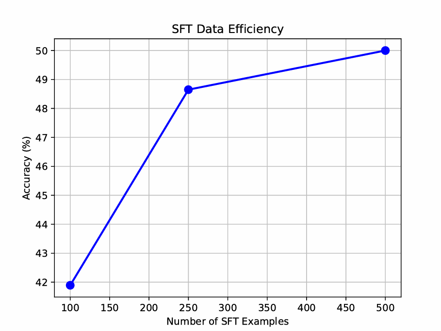

# GRPO Fine-tuning for Mathematical Reasoning on GSM8K

Implementing GRPO from scratch to fine-tune Qwen2 (0.5B, 1.5B, 7B) on GSM8K,
with a scaling analysis across model sizes and a data-efficiency comparison against SFT.

---

## Overview

This project applies Group Relative Policy Optimisation (GRPO) to fine-tune Qwen2-Instruct models on GSM8K without any human demonstrations,
using only a scalar correctness reward. The work covers a from-scratch GRPO loss
implementation, reward function design, multi-GPU training for Qwen2-7B, and a direct
comparison of RL versus GPT-4o-distilled SFT across three dataset sizes (100, 250, 500
examples).

All experiments ran on Vast.ai H100 SXM instances — single GPU for Qwen2-0.5B and 1.5B,
dual GPU for Qwen2-7B.

---

## Environment Setup

Migrated from a full `pip freeze` system dump to a minimal `uv` + `pyproject.toml`
dependency specification, keeping only packages directly imported by the codebase.

```bash
uv init --no-readme
uv python install 3.10
uv venv --python 3.10
uv add -r requirements.txt
uv sync
```

Flash Attention 2 requires `--no-build-isolation` so the build process can resolve the
existing PyTorch/CUDA installation. Without it, compilation fails. Compiles from source
in ~15 minutes.

```bash
uv pip install flash-attn --no-build-isolation
```

---

## Reward Function Structure


**Fix 1 — No penalty for incorrect predictions.** Wrong answers received `0.0`, identical
to missing format tags. GRPO updates are driven by relative reward differences across
completions in a group — a flat reward surface produces near-zero advantages and kills
the gradient signal. Fixed with a contrastive reward:

```python
# before
rewards.append(2.0 if pred_i == gt_i else 0.0)

# after
rewards.append(2.0 if pred_i == gt_i else -1.0)
```

**Fix 2 — Missing `<answer>` tags not penalised.** `_extract_xml_answer` returns `""`
when no tags are found. Without an explicit guard, the empty string falls through to the
comparison branch and receives `0.0` — same score as a correctly formatted wrong answer:

```python
if not pred:
    rewards.append(-1.0)
    continue
```

**Fix 3 — Duplicate XML tags not caught in `_xml_count_reward`.** The `in` operator
returns `True` regardless of tag count, so responses with repeated tags were rewarded
as correctly formatted. Replaced with exact-count checks:

```python
# before
r_open = "<reasoning>" in text

# after
r_open  = text.count("<reasoning>") == 1
r_close = text.count("</reasoning>") == 1
a_open  = text.count("<answer>") == 1
a_close = text.count("</answer>") == 1
```

---

## GRPO Loss Implementation

### On-policy simplification

The standard GRPO objective applies an importance sampling ratio
$\pi_\theta / \pi_\theta^{old}$ with PPO-style clipping:

$$\mathcal{L}^{GRPO} = \frac{\pi_{\theta}(a_t \mid s_t)}{\pi_{\theta}^{old}(a_t \mid s_t)} \cdot \hat{A}_i$$

This is necessary when rollouts are reused across multiple gradient updates — after
the first update $\pi_\theta \neq \pi_\theta^{old}$ and the ratio drifts away from 1.
The $\varepsilon$-clipping then stabilises training by constraining the ratio to
$[1-\varepsilon, 1+\varepsilon]$.

The training loop in `main.py` is fully on-policy, fresh completions are sampled from
the current policy at every iteration with an immediate gradient step:

```python
for round_num in range(start_step, args.num_train_iters):
    question, answer = next(train_loader)
    total_loss = grpo_loss(...)  # samples from current π_θ
    total_loss.backward()
    optimizer.step()
```

Since $\pi_\theta^{old} = \pi_\theta$ at the point of sampling:

$$\frac{\pi_{\theta}(a_t \mid s_t)}{\pi_{\theta}^{old}(a_t \mid s_t)} = 1 \quad \forall t$$

The ratio is always 1, clipping never activates, and the objective reduces to REINFORCE
with a KL penalty. The implemented loss is therefore:

$$\mathcal{L}(\theta) = -\frac{1}{N}\sum_{i=1}^{N} \frac{1}{T_i}\sum_{t=1}^{T_i}
\left[ \hat{A}_i \cdot \log\pi_{\theta}(a_t \mid s_t) - \beta \cdot \widehat{\mathbb{KL}}_t \right]$$

The KL term uses the DeepSeek-R1 estimator:

$$\widehat{\mathbb{KL}}_t = e^{\delta_t} - \delta_t - 1, \quad \delta_t = \log\pi_{ref}(a_t \mid s_t) - \log\pi_{\theta}(a_t \mid s_t)$$

This estimator is always $\geq 0$ and equals $0$ only when $\pi_\theta = \pi_{ref}$.

### Extending to multi-epoch GRPO

To reuse rollouts across $\mu$ gradient steps (true GRPO), three changes are needed:

**1.** Compute and detach `old_logps` before the inner loop:

```python
with torch.inference_mode():
    old_logps = get_per_token_logps(model, ...).detach()
```

**2.** Replace the policy objective with the clipped IS ratio:

```python
ratio = torch.exp(per_token_logps - old_logps)
clipped = torch.clamp(ratio, 1 - args.clamp_epsilon, 1 + args.clamp_epsilon)
per_token_policy_obj = torch.min(ratio * advantages, clipped * advantages)
```

**3.** Add an inner loop that reuses each set of rollouts for $\mu$ steps before
sampling new completions.

### Training & Results


---

## Scaling Analysis (Qwen2-0.5B / 1.5B / 7B)

### Multi-GPU setup for Qwen2-7B

Running Qwen2-7B with a frozen reference copy requires ~56GB VRAM (2× bfloat16 copies
of a 14GB model), which exceeds a single H100's 80GB when combined with activations and
optimiser state. Two changes were needed:

**`llms.py` — switched to `device_map="auto"`** to let HuggingFace distribute layers
across both GPUs automatically:

```python
# before
model = AutoModelForCausalLM.from_pretrained(
    model_name,
    torch_dtype=torch.bfloat16,
    attn_implementation="flash_attention_2",
    device_map=None,
).to(device)

# after
model = AutoModelForCausalLM.from_pretrained(
    model_name,
    torch_dtype=torch.bfloat16,
    attn_implementation="flash_attention_2",
    device_map="auto",
)
```

**`main.py` — device inference from model parameters:** With `device_map="auto"` there
is no single `.device` attribute to move tensors to. Fixed by inferring from the first
parameter:

```python
# before
prompt_ids = prompt_ids.to(device)

# after
model_device = next(model.parameters()).device
prompt_ids = prompt_ids.to(model_device)
```

Both changes are backwards-compatible — on a single GPU `device_map="auto"` places
everything on `cuda:0`, identical to the original behaviour. VRAM pressure also required
reducing the GRPO group size from 16 to 8 chains for Qwen2-7B.

### Results


### Observations

**Log-linear scaling with parameter count.** Final accuracy scales log-linearly with
model size: Qwen2-0.5B → 47%, Qwen2-1.5B → 74%, Qwen2-7B → 92%. Plotting against
log-scale parameter count yields a near-straight line, consistent with standard neural
scaling law predictions.

**Capacity ceilings are model-size dependent, not training-duration dependent.** All
three models follow an S-curve — slow initial phase, rapid improvement, plateau. The
plateau level is set by parameter count:

- Qwen2-0.5B saturates at ~50% by step 700; additional steps produce no improvement
- Qwen2-1.5B plateaus at ~74% with signs of marginal continued improvement
- Qwen2-7B reaches ~92% with a slight upward trend at step 1000

**The exploration bottleneck.** GRPO only generates a learning signal when the policy
occasionally produces a correct completion — if reward variance within a group is zero,
all normalised advantages are zero and no gradient flows:

$$\text{reward\_std} \approx 0 \implies \hat{A}_i \approx 0 \implies \nabla_\theta \mathcal{L} \approx 0$$

This explains Qwen2-0.5B's flat first ~200 steps: the model needs to stumble onto
correct completions before GRPO can amplify them. Qwen2-7B starts at 64% zero-shot
accuracy and benefits from a consistent reward signal immediately, matching DeepSeek-R1's
finding that GRPO is most effective above ~1B parameters.

**Absolute vs relative gains across scales:**

| Model | Step 0 | Step 1000 | Absolute Gain |
|-------|--------|-----------|---------------|
| Qwen2-0.5B | ~1% | ~47% | +46% |
| Qwen2-1.5B | ~29% | ~74% | +45% |
| Qwen2-7B | ~64% | ~92% | +28% |

Absolute gains are similar for 0.5B and 1.5B, but Qwen2-7B achieves a substantially
higher ceiling from a much stronger initialisation. Model size is the dominant factor —
it determines the zero-shot baseline, the capacity ceiling, and the strength of the
reward signal throughout training. Extended RL training on a capacity-limited model
does not substitute for scale.

---

## RL vs SFT Data Efficiency

### Setup

700 GSM8K solutions were generated via GPT-4o (OpenAI API), prompted with the same
system prompt used during GRPO training to ensure format consistency
(`<reasoning>...</reasoning><answer>...</answer>`). SFT was then run on Qwen2-0.5B-Instruct
using HuggingFace `Trainer` with cross-entropy loss computed exclusively on completion
tokens (prompt tokens masked with `-100`), across three dataset sizes: 100, 250, and
500 examples.

### Results




### Analysis

Both approaches plateau at ~50% on Qwen2-0.5B, but their paths there expose a large
difference in gradient signal density.

**SFT computes a cross-entropy loss at every completion token.** A 200-token response
yields 200 independent gradient updates per example — each directly supervising the
exact next-token distribution. 100 GPT-4o demonstrations are enough for SFT to reach
42% accuracy, a level that GRPO requires ~300–400 steps × 16 chains (~5,000 forward
passes) to match.

**GRPO assigns a single scalar reward to the entire completion.** That reward is
broadcast uniformly across all tokens in the sequence as a constant advantage $\hat{A}_i$.
The per-token gradient signal is therefore heavily diluted — the model receives no
information about which token-level decisions drove the outcome. This is the credit
assignment problem: GRPO must infer token-level responsibility from a sequence-level
scalar, whereas SFT has exact token-level supervision at every position.

**Why use GRPO at all?** Generating 500 GPT-4o solutions has a direct API cost and
requires a capable teacher model whose output distribution the student will partially
inherit (style overfitting). GRPO requires only questions and a verifiable reward
function — no teacher model, no demonstrations. In domains where ground-truth solutions
are expensive or impossible to generate (e.g. code execution, formal proofs, novel
reasoning tasks), GRPO's sample inefficiency is an acceptable trade-off for not
requiring a supervision source at all.